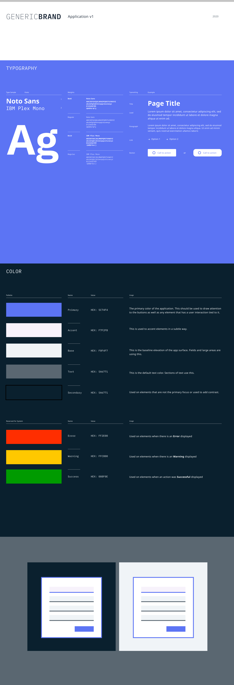

# Brand Guidelines

Here is a link to the **[Brand Guidelines](https://bit.ly/3pGrcoB)** document for refference. Vector or Raster logos maybe be added here to refer to at a later time.

## Example Document

Below you will find and example of how Type and Color are used to create a theme for a brand.



```css
// brand variables
$color-primary: #004987; //skyBlue
$color-secondary: #8f8f8f; //deepGreen
$color-accent: #f7f2fb; // lightBlue
$color-base: #f7a800; // lightBlue
$text-color: #3c3c3c; //mediumGrey

// system colors
$action-color: red;
$warning-color: orange;
$success-color: green;
```

### Basic Colors

```js
export const aqua = "#00ffff";
export const black = "#000000";
export const blue = "#0000ff";
export const fuchsia = "#ff00ff";
export const gray = "#808080";
export const green = "#008000";
export const lime = "#00ff00";
export const maroon = "#800000";
export const navy = "#000080";
export const olive = "#808000";
export const purple = "#800080";
export const red = "#ff0000";
export const silver = "#c0c0c0";
export const teal = "#008080";
export const white = "#ffffff";
export const yellow = "#ffff00";
```
